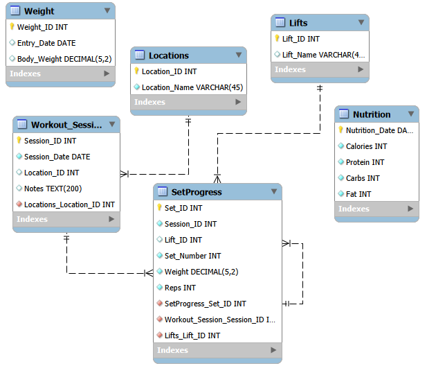
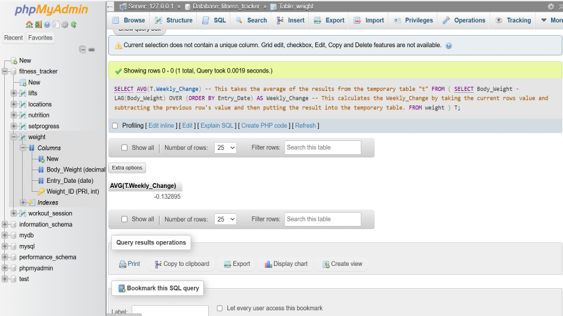
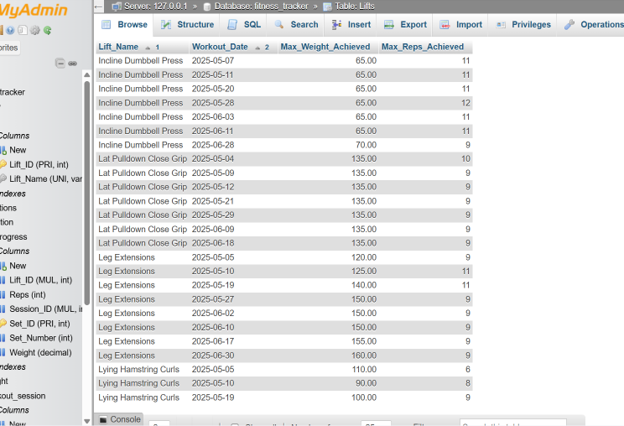
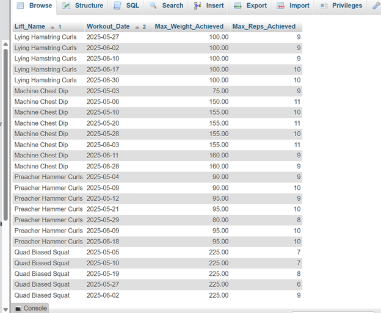
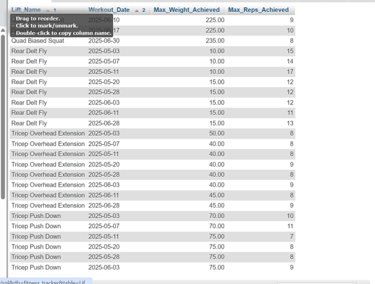
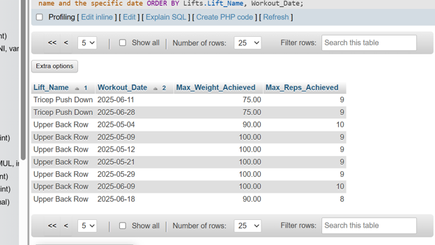
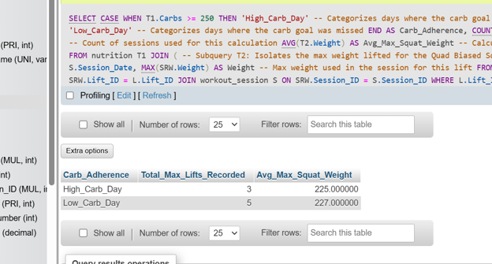

# Personal Biometric, Nutrition, and Strength Analytics Pipeline

## Project Overview
I built this relational SQL database to track my personal health, nutrition, and strength training data over a three-month window. During an active caloric deficit ("cutting phase"), I maintained near-perfect daily logs tracking body weight, exact macronutrient intake (calories, protein, carbohydrates, fat), and progressive overload performance metrics across every workout session (exercises, sets, reps, and weight loaded). 

The goal of this project was to design a custom database schema from scratch and implement advanced SQL queries to analyze how consistently hitting my nutritional targets correlated with strength performance.

---

## Relational Database Design & Schema

### Entity-Relationship (ER) Diagram
The database maps daily training transactions across normalized dimension and fact tables. I implemented a junction table (`SetProgress`) to resolve the many-to-many relationship between individual workout sessions and specific lifts.



### Table DDL Structure
Below are the schema definitions utilized to organize and connect my tracking data:

#### 1. Location Dimension Table
| Column Name | Data Type | Constraints |
| :--- | :--- | :--- |
| `Location_ID` | INT | PK, AI |
| `Location_Name` | VARCHAR(255) | NOT NULL |

#### 2. Lifts Dimension Table
| Column Name | Data Type | Constraints |
| :--- | :--- | :--- |
| `Lift_ID` | INT | PK, AI |
| `Lift_Name` | VARCHAR(255) | NOT NULL |

#### 3. Workout Session Dimension Table
| Column Name | Data Type | Constraints |
| :--- | :--- | :--- |
| `Session_ID` | INT | PK, AI |
| `Session_Date` | DATE | NOT NULL, UNIQUE |
| `Location_ID` | INT | FK |

#### 4. SetProgress Fact Table
| Column Name | Data Type | Constraints |
| :--- | :--- | :--- |
| `Set_ID` | INT | PK, AI |
| `Session_ID` | INT | FK |
| `Lift_ID` | INT | FK |
| `Set_Number` | INT | NOT NULL |
| `Weight` | DECIMAL(5,2) | NOT NULL |
| `Reps` | INT | NOT NULL |

#### 5. Nutrition Log Table
| Column Name | Data Type | Constraints |
| :--- | :--- | :--- |
| `Nutrition_Date` | DATE | PK |
| `Calories` | INT | NOT NULL |
| `Fat` | INT | NOT NULL |
| `Protein` | INT | NOT NULL |
| `Carbs` | INT | NOT NULL |

#### 6. Body Weight Tracking Table
| Column Name | Data Type | Constraints |
| :--- | :--- | :--- |
| `Weight_ID` | INT | PK, AI |
| `Entry_Date` | DATE | NOT NULL, UNIQUE |
| `Body_Weight` | DECIMAL(5,2) | NOT NULL |

---

## Advanced SQL Queries & Analytics

### Query 1: Time-Series Weight Loss Velocity (Window Functions)
**Objective:** Calculate the average daily weight loss rate across the dataset using the `LAG()` analytical window function to track time-series changes.

```sql
SELECT
    AVG(T.Weekly_Change)
FROM (
    SELECT
        Body_Weight - LAG(Body_Weight) OVER (ORDER BY Entry_Date) AS Weekly_Change
    FROM weight
) T;

```

**Output Result:**
This query calculates an average weight change of -0.133 lbs per day. This confirms that my caloric deficit was dialed in correctly, maintaining a steady, sustainable fat loss pace of around 1 lb lost per week over the tracking period (-1.5  lbs per week at the start shifting towards -.75 lbs per week at the end)



### Query 2: Peak Progressive Overload Tracking (Aggregations & Joining)
**Objective:** Group and isolate the absolute maximum weight and maximum repetition volume achieved per exercise on every distinct training date to evaluate workout progression over time.

```sql
SELECT
    Lifts.Lift_Name,
    DATE(workout_session.Session_Date) AS Workout_Date,
    MAX(setprogress.Weight) AS Max_Weight_Achieved,
    MAX(setprogress.Reps) AS Max_Reps_Achieved
FROM setprogress
JOIN workout_session ON setprogress.Session_ID = workout_session.Session_ID
JOIN Lifts ON setprogress.Lift_ID = Lifts.Lift_ID
GROUP BY
    Lifts.Lift_Name,
    DATE(workout_session.Session_Date)
ORDER BY
    Lifts.Lift_Name,
    Workout_Date;
```

**Output Result:**
The data output confirms that my compound lifting strength remained remarkably stable despite operating in a prolonged caloric deficit. I was also able to successfully log minor progressive overload performance gains on isolated movements (such as Cable Curls) over the course of the tracking window.







### Query 3: Multi-Variable Conditional Analysis (Subqueries & Conditional Logic)
**Objective:** Evaluate strength output based on daily carbohydrate macro targets (250g goal). A conditional CASE statement groups dates into 'High' or 'Low' carb compliance, which is then joined against a nested analytical subquery filtering peak performance on a compound movement (Quad Biased Squat, Lift_ID = 12).

```sql
SELECT
    CASE
        WHEN T1.Carbs >= 250 THEN 'High_Carb_Day'
        ELSE 'Low_Carb_Day'
    END AS Carb_Adherence,
    COUNT(T2.Weight) AS Total_Max_Lifts_Recorded,
    AVG(T2.Weight) AS Avg_Max_Squat_Weight
FROM nutrition T1
JOIN (
    SELECT
        S.Session_Date,
        MAX(SRW.Weight) AS Weight
    FROM setprogress SRW
    JOIN Lifts L ON SRW.Lift_ID = L.Lift_ID
    JOIN workout_session S ON SRW.Session_ID = S.Session_ID
    WHERE L.Lift_ID = 12
    GROUP BY S.Session_Date
) T2
ON T1.Nutrition_Date = T2.Session_Date
GROUP BY 1;
```
**Output Result:**
While the SQL code executed cleanly, the output reveals a negligible change in average top squat capabilities between low-carb days (227 lbs) and target days (225 lbs).

From a data literacy standpoint, analyzing this dataset highlights key constraints and tracking limitations:

Sample Size Limitations: The query captures an 8-session squat window, which lacks statistical significance for broad correlations.

Variables: Glycogen availability from carbohydrates is not the only factor dictating gym performance. Massive outside parameters were untracked in this database schema, including sleep quality, pre workout carb timing, pre workout stimulants (caffeine), stress, and the accumulation of systemic fatigue over a long-term fat-loss phase.



### Project Conclusion
Designing and implementing this project provided practical experience structuring relational schemas around real world data. The time-series metrics successfully verified that a strict diet works in preserving lean tissue and muscle strength during active fat loss phases. It stands as a solid model for modeling and analyzing, self tracked physiological data.
